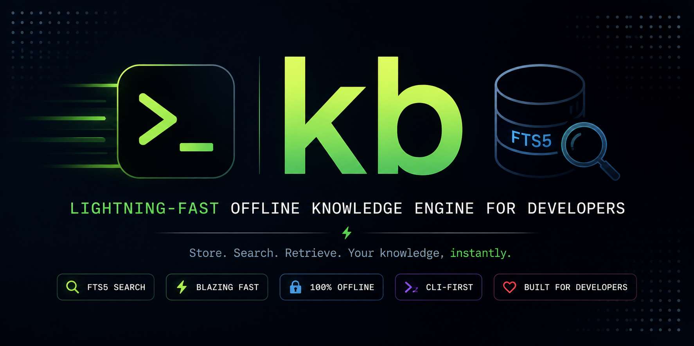

<!-- ========================================================= -->
<!--                           BANNER                          -->
<!-- ========================================================= -->

<p align="center">
  <!-- Replace with your banner -->
  
</p>

<h1 align="center">
kb
</h1>

<p align="center">
<b>⚡ Lightning-fast offline knowledge engine for developers.</b>
</p>

<p align="center">
Store commands, snippets, SQL queries, troubleshooting notes, and engineering knowledge in a local SQLite database with blazing-fast Full-Text Search.
</p>

<p align="center">


</p>

---

## 🎬 Demo

<p align="center">

</p>

---

# Why kb?

Every developer builds a personal knowledge base over time.

Git commands.

Docker snippets.

SQL queries.

Terraform modules.

AWS CLI commands.

Kubernetes manifests.

Debugging notes.

Configuration snippets.

Unfortunately, that knowledge usually ends up scattered across multiple places:

- Markdown files
- Notion
- Obsidian
- Browser bookmarks
- GitHub Gists
- Terminal history
- Sticky notes

Finding something later often means opening multiple files and repeatedly pressing **Ctrl + F**.

`kb` replaces that workflow with a fast, offline knowledge engine powered by **SQLite FTS5**, giving you instant full-text search across everything you've saved.

**No cloud. No subscriptions. Just your knowledge, indexed locally.**

# ✨ Features

`kb` is designed to be a fast, keyboard-first knowledge engine that lives entirely on your machine.

| Feature                     | Description                                                         |
| --------------------------- | ------------------------------------------------------------------- |
| ⚡ SQLite FTS5 Search       | Lightning-fast full-text search across all knowledge                |
| 🏷 Categories & Tags         | Organize snippets by category and searchable tags                   |
| ⭐ Favorites                | Mark frequently used snippets for quick access                      |
| 🔍 Interactive Fuzzy Search | Browse your knowledge base with an `fzf` powered interface          |
| 🖥 Interactive Shell         | Persistent history, tab completion, aliases and REPL mode           |
| 📋 Clipboard Support        | Copy snippets directly to your clipboard                            |
| 📂 Import & Export          | Import Markdown/TXT and export to Markdown or JSON                  |
| 📊 Statistics               | View usage statistics and most accessed snippets                    |
| 🎨 Rich Terminal Output     | Colorized output for a better CLI experience                        |
| 💾 Offline First            | No cloud account, internet connection or external services required |
| 🐧 Cross Platform           | Works on macOS and Linux                                            |

---

# 🚀 Installation

## Requirements

- Python **3.10+**
- SQLite (included with Python)
- `fzf` _(optional but recommended for the interactive search interface)_

### Install from PyPI

```bash
pip install kb-cli
```

Verify the installation

```bash
kb --version
```

Example output

```text
kb version 0.2.0
```

---

## Optional Dependencies

### Install fzf

#### macOS

```bash
brew install fzf
```

#### Ubuntu / Debian

```bash
sudo apt install fzf
```

### Install bat (Recommended)

`bat` provides syntax highlighted previews inside the interactive search interface.

#### macOS

```bash
brew install bat
```

#### Ubuntu / Debian

```bash
sudo apt install bat
```

---

## Homebrew

> 🚧 Homebrew support is planned for a future release.

---

# ⚡ Quick Start

Initialize your local knowledge database

```bash
kb init
```

Save your first snippet

```bash
kb add git "git status" \
    -t "Git Status" \
    --tags git,status
```

Search your knowledge

```bash
kb find git
```

Browse everything interactively

```bash
kb fzf
```

Launch the interactive shell

```bash
kb
```

View statistics

```bash
kb stats
```

You're ready to start building your personal offline knowledge base.

# 📖 Command Reference

| Command       | Description                                   |
| ------------- | --------------------------------------------- |
| `kb init`     | Initialize the local knowledge database       |
| `kb add`      | Add a new knowledge entry                     |
| `kb list`     | List stored entries                           |
| `kb find`     | Perform full-text search using SQLite FTS5    |
| `kb get`      | Retrieve a snippet by ID                      |
| `kb edit`     | Edit an existing entry                        |
| `kb delete`   | Delete an entry                               |
| `kb favorite` | Mark or unmark an entry as a favorite         |
| `kb recent`   | Show recently accessed entries                |
| `kb stats`    | Display database statistics                   |
| `kb import`   | Import Markdown or TXT files                  |
| `kb export`   | Export the knowledge base to Markdown or JSON |
| `kb copy`     | Copy a snippet directly to the clipboard      |
| `kb fzf`      | Launch the interactive fuzzy finder           |

---

# 💡 Usage Examples

## Git

Save a useful Git command

```bash
kb add git \
"git rebase -i HEAD~3" \
-t "Interactive Rebase" \
--tags git,rebase
```

Search it later

```bash
kb find rebase
```

---

## Docker

Store Docker Compose commands

```bash
kb add docker \
"docker compose up -d" \
-t "Start Containers" \
--tags docker,compose
```

---

## SQL

Save frequently used SQL queries

```bash
kb add sql \
"SELECT * FROM users WHERE active = TRUE;" \
-t "Active Users" \
--tags postgres,sql
```

---

## AWS CLI

Save AWS commands

```bash
kb add aws \
"aws s3 sync ./dist s3://my-bucket" \
-t "Upload Build Artifacts"
```

---

## Kubernetes

Store kubectl commands

```bash
kb add kubernetes \
"kubectl logs deployment/api -f" \
-t "Follow Deployment Logs"
```

---

## Terraform

Save infrastructure commands

```bash
kb add terraform \
"terraform state list" \
-t "List Terraform Resources"
```

---

## Search Across Everything

SQLite FTS5 searches titles, content and tags.

```bash
kb find terraform

kb find docker compose

kb find postgres

kb find eks
```

---

## Browse Interactively

Launch the interactive fuzzy finder

```bash
kb fzf
```

Features include:

- Live fuzzy filtering
- Instant preview
- Clipboard copy
- Keyboard-first workflow
- tmux popup support
- Optional syntax-highlighted previews with `bat`

---

## Interactive Shell

Launch the built-in REPL

```bash
kb
```

Example session

```text
kb ❯ add
kb ❯ find docker
kb ❯ get 12
kb ❯ favorite 12
kb ❯ recent
kb ❯ stats
kb ❯ exit
```

The interactive shell supports:

- Persistent command history
- Tab completion
- Command aliases
- Colored prompt
- Keyboard-first workflow

---

## Export Your Knowledge

Export everything as Markdown

```bash
kb export markdown notes.md
```

Export as JSON

```bash
kb export json knowledge.json
```

---

## Import Existing Notes

Import a Markdown document

```bash
kb import notes.md
```

Import a plain text file

```bash
kb import commands.txt
```

---

# 🏗 Project Architecture

`kb` follows a simple layered architecture to keep the codebase modular, maintainable, and easy to extend.

```text
                    User
                     │
                     ▼
              kb CLI Interface
                     │
                     ▼
          Command Layer (CLI Commands)
                     │
                     ▼
             Service / Business Logic
                     │
                     ▼
             Repository (SQLite)
                     │
                     ▼
           SQLite Database (FTS5)
                     │
                     ▼
              Local File System
```

### Project Structure

```text
kb-cli/
├── kb/
│   ├── commands/          # CLI commands
│   ├── repositories/      # SQLite queries
│   ├── services/          # Business logic
│   ├── models/            # Data models
│   ├── utils/             # Helpers & formatting
│   ├── shell.py           # Interactive shell
│   ├── shell_commands.py  # Interactive shell commands
│   ├── database.py
│   ├── config.py
│   └── cli.py
│
├── tests/
├── assets/
├── README.md
├── pyproject.toml
└── LICENSE
```

---

# ⚙️ Tech Stack

| Component           | Technology     |
| ------------------- | -------------- |
| Language            | Python 3.10+   |
| Database            | SQLite         |
| Search Engine       | SQLite FTS5    |
| Interactive Search  | fzf            |
| Syntax Highlighting | bat (optional) |
| Testing             | Pytest         |
| Linting             | Ruff           |
| Packaging           | setuptools     |
| CI/CD               | GitHub Actions |

---

# 🚀 Roadmap

## ✅ v0.2.0

- SQLite FTS5 Full-Text Search
- Interactive Shell
- Interactive Fuzzy Search (`fzf`)
- Clipboard Support
- Rich Terminal Output
- Categories & Tags
- Favorites
- Import / Export
- Usage Statistics
- Shell Completion
- PyPI Package
- GitHub Actions CI

---

## 🔜 Planned Features

### v0.3

- [ ] Homebrew Installation
- [ ] Search Result Highlighting
- [ ] Rich Metadata Preview
- [ ] Multi-select in `fzf`
- [ ] YAML Import / Export
- [ ] Config Profiles

### Future Ideas

- [ ] Plugin System
- [ ] Encrypted Database
- [ ] Optional Cloud Sync
- [ ] Custom Themes
- [ ] AI-assisted Search

---

# 🤝 Contributing

Contributions are welcome!

If you'd like to improve **kb**, follow these steps:

```bash
git clone https://github.com/Hrithik5/kb-cli.git

cd kb-cli

pip install -e .

ruff check .

pytest
```

Before opening a Pull Request, please ensure:

- Code is formatted
- Ruff passes without errors
- All tests pass
- New features include tests where appropriate

Bug reports, feature requests, and pull requests are always appreciated.

---

# 📝 Changelog

See the full project history in **CHANGELOG.md**.

---

# 📄 License

This project is licensed under the **MIT License**.

See the **LICENSE** file for details.

---

# ⭐ Support the Project

If you find **kb** useful, consider giving the repository a ⭐ on GitHub.

It helps others discover the project and motivates future development.

---

<p align="center">

Built for developers who believe great tools should be **fast**, **local**, and **simple**.

</p>
